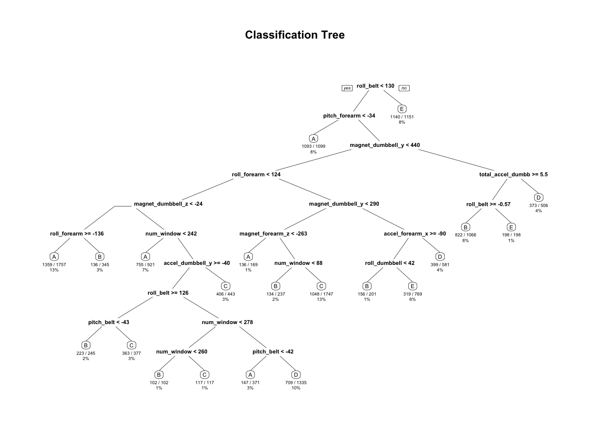

# Machine Learning Project
Ana Minguez  

## 1. Introduction

Using devices such as *Jawbone Up, Nike FuelBand*, and *Fitbit* it is now possible to collect a large amount of data about personal activity relatively inexpensively. These type  of divices are part of the quantified self movement - a group of enthusiasts who take measurements about themselves regularly to improve their health, to find patterns in their behavior, or because they are tech geeks. One thing that people regularly do is quantify *how much* of a particular activity they do, but they rarely quantify *how well* they do it. In this project, your goal will be to use data from accelerometers on the belt, forearm, arm, and dumbell of 6 participants. They were asked to perform barbell lifts correctly and incorrectly in 5 different ways. More information is available from the website here:

<http://groupware.les.inf.puc-rio.br/har> (see the section on the Weight Lifting Exercise Dataset).

### Data:
The training data for this project are available here:

<https://d396qusza40orc.cloudfront.net/predmachlearn/pml-training.csv>

The test data are available here:

<https://d396qusza40orc.cloudfront.net/predmachlearn/pml-testing.csv>

The data for this project come from this source: <http://groupware.les.inf.puc-rio.br/har>.

### Objective:
The goal of your project is to predict the manner in which they did the exercise. This is the "classe" variable in the training set. You may use any of the other variables to predict with. You should create a report describing how you built your model, how you used cross validation, what you think the expected out of sample error is, and why you made the choices you did. You will also use your prediction model to predict 20 different test cases.

## 2. Analysis
### Loading Packages and setting up reproductivity:

```r
# Packages needed
library(caret)
```

```
## Loading required package: lattice
```

```
## Loading required package: ggplot2
```

```r
library(randomForest)
```

```
## randomForest 4.6-12
```

```
## Type rfNews() to see new features/changes/bug fixes.
```

```
## 
## Attaching package: 'randomForest'
```

```
## The following object is masked from 'package:ggplot2':
## 
##     margin
```

```r
library(rpart)
library(rpart.plot)

# Set seed for reproducibility
set.seed(12000)
```

### Loading and Cleaning Data:
We load the training data and we clean them. It is important to recode all blank values and "#DIV/0!" into NA.

```r
data<-read.csv("pml-training.csv",na.strings = c("NA","#DIV/0!",""))
```
The DataSet contains a big number of field with a big number of NA, we remove all the variables with more that 50% of NA


```r
toclean<-sapply(colnames(data), function(x) if(sum(is.na(data[,x]))>0.5*nrow(data)){return(TRUE)}else{return(FALSE)})
data<-data[,!toclean]
## We can also exclude ids, personal identifications, etc
data<-data[,-(1:6)]
```

Now, we have a data set with **54** variables.


```r
names(data)
```

```
##  [1] "num_window"           "roll_belt"            "pitch_belt"          
##  [4] "yaw_belt"             "total_accel_belt"     "gyros_belt_x"        
##  [7] "gyros_belt_y"         "gyros_belt_z"         "accel_belt_x"        
## [10] "accel_belt_y"         "accel_belt_z"         "magnet_belt_x"       
## [13] "magnet_belt_y"        "magnet_belt_z"        "roll_arm"            
## [16] "pitch_arm"            "yaw_arm"              "total_accel_arm"     
## [19] "gyros_arm_x"          "gyros_arm_y"          "gyros_arm_z"         
## [22] "accel_arm_x"          "accel_arm_y"          "accel_arm_z"         
## [25] "magnet_arm_x"         "magnet_arm_y"         "magnet_arm_z"        
## [28] "roll_dumbbell"        "pitch_dumbbell"       "yaw_dumbbell"        
## [31] "total_accel_dumbbell" "gyros_dumbbell_x"     "gyros_dumbbell_y"    
## [34] "gyros_dumbbell_z"     "accel_dumbbell_x"     "accel_dumbbell_y"    
## [37] "accel_dumbbell_z"     "magnet_dumbbell_x"    "magnet_dumbbell_y"   
## [40] "magnet_dumbbell_z"    "roll_forearm"         "pitch_forearm"       
## [43] "yaw_forearm"          "total_accel_forearm"  "gyros_forearm_x"     
## [46] "gyros_forearm_y"      "gyros_forearm_z"      "accel_forearm_x"     
## [49] "accel_forearm_y"      "accel_forearm_z"      "magnet_forearm_x"    
## [52] "magnet_forearm_y"     "magnet_forearm_z"     "classe"
```

### Spliting the data:
Now we should split our dataset in 2 partitions: 70% training set and 30% testing set. 

```r
partition<-createDataPartition(data$classe,p=0.7, list=FALSE)
training<-data[partition, ]
testing<-data[-partition,]
dim(training)
```

```
## [1] 13737    54
```

```r
dim(testing)
```

```
## [1] 5885   54
```

### Selecting Model:
In this section we will estimate different methods to select the most accurate method.

#### a. Decision Tree

```r
treemod<-rpart(classe~., data=training, method="class")
treepred<-predict(treemod,testing,type="class")
confusionMatrix(treepred,testing$classe)
```

```
## Confusion Matrix and Statistics
## 
##           Reference
## Prediction    A    B    C    D    E
##          A 1508  198   54   61   43
##          B   60  672   40   72  124
##          C   23   66  817  146   81
##          D   68  142   60  635  143
##          E   15   61   55   50  691
## 
## Overall Statistics
##                                           
##                Accuracy : 0.7346          
##                  95% CI : (0.7231, 0.7458)
##     No Information Rate : 0.2845          
##     P-Value [Acc > NIR] : < 2.2e-16       
##                                           
##                   Kappa : 0.6632          
##  Mcnemar's Test P-Value : < 2.2e-16       
## 
## Statistics by Class:
## 
##                      Class: A Class: B Class: C Class: D Class: E
## Sensitivity            0.9008   0.5900   0.7963   0.6587   0.6386
## Specificity            0.9155   0.9376   0.9350   0.9161   0.9623
## Pos Pred Value         0.8090   0.6942   0.7211   0.6059   0.7924
## Neg Pred Value         0.9587   0.9050   0.9560   0.9320   0.9220
## Prevalence             0.2845   0.1935   0.1743   0.1638   0.1839
## Detection Rate         0.2562   0.1142   0.1388   0.1079   0.1174
## Detection Prevalence   0.3167   0.1645   0.1925   0.1781   0.1482
## Balanced Accuracy      0.9081   0.7638   0.8656   0.7874   0.8005
```

```r
rpart.plot(treemod,main="Classification Tree", extra=102,under = TRUE, faclen=0)
```



#### b. Random Forest

```r
rfmod<-randomForest(classe~., data=training, method="class")
rfpre<-predict(rfmod,testing,type="class")
confusionMatrix(rfpre,testing$classe)
```

```
## Confusion Matrix and Statistics
## 
##           Reference
## Prediction    A    B    C    D    E
##          A 1674    1    0    0    0
##          B    0 1138   10    0    0
##          C    0    0 1016    4    0
##          D    0    0    0  960    2
##          E    0    0    0    0 1080
## 
## Overall Statistics
##                                           
##                Accuracy : 0.9971          
##                  95% CI : (0.9954, 0.9983)
##     No Information Rate : 0.2845          
##     P-Value [Acc > NIR] : < 2.2e-16       
##                                           
##                   Kappa : 0.9963          
##  Mcnemar's Test P-Value : NA              
## 
## Statistics by Class:
## 
##                      Class: A Class: B Class: C Class: D Class: E
## Sensitivity            1.0000   0.9991   0.9903   0.9959   0.9982
## Specificity            0.9998   0.9979   0.9992   0.9996   1.0000
## Pos Pred Value         0.9994   0.9913   0.9961   0.9979   1.0000
## Neg Pred Value         1.0000   0.9998   0.9979   0.9992   0.9996
## Prevalence             0.2845   0.1935   0.1743   0.1638   0.1839
## Detection Rate         0.2845   0.1934   0.1726   0.1631   0.1835
## Detection Prevalence   0.2846   0.1951   0.1733   0.1635   0.1835
## Balanced Accuracy      0.9999   0.9985   0.9947   0.9977   0.9991
```

#### Summary

The Random Forest model provides the best results. It has an accuracy of 99.7% and an out of sample error of 0.3%. We will select the Random Forest model for the screening test.

### Prediction Quiz
We clean the data, same process as before:


```r
data<-read.csv("pml-testing.csv",na.strings = c("NA","#DIV/0!",""))
toclean<-sapply(colnames(data), function(x) if(sum(is.na(data[,x]))>0.5*nrow(data)){return(TRUE)}else{return(FALSE)})
data<-data[,!toclean]
data<-data[,-(1:6)]
pre<-predict(rfmod,data,type="class")
```
Using Random Forest model we obtain an 100% of accuracy in the prediction test.
